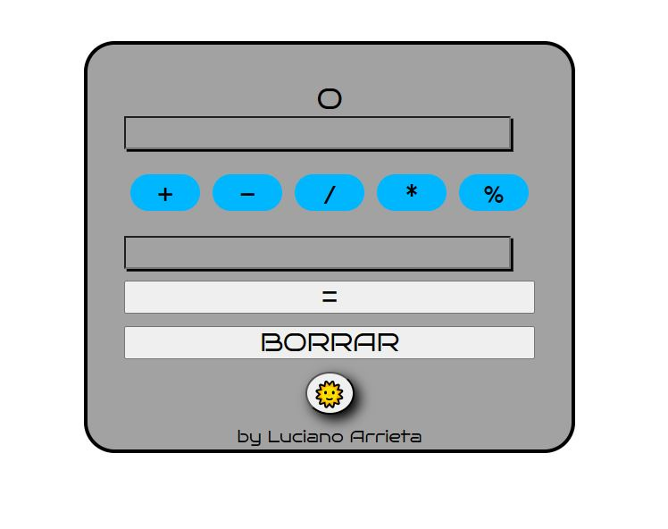

# Calculadora

## Páginas Web con Componentes Dinámicos

> Argentina Programa 4.0

Para esta calculadora sencilla se uso codigo HTML, CSS y Javascript.

Para realizar las operaciones el usuario debe ingresar dos valores, siendo el de arriba el primero y el de abajo el segundo. Luego de ingresar los números, el usuario debe seleccionar el tipo de operación. El boton **=** mostrara el resultado en la parte superior de la calculadora.

El boton **BORRAR** dejará en blanco los campos para realizar otra operación.

En la parte inferior se encuentra el boton **MODO** con un EMOJI para destacarlo, que al presionarlo modificará el fondo del HTML para crear un modo "nocturno".

